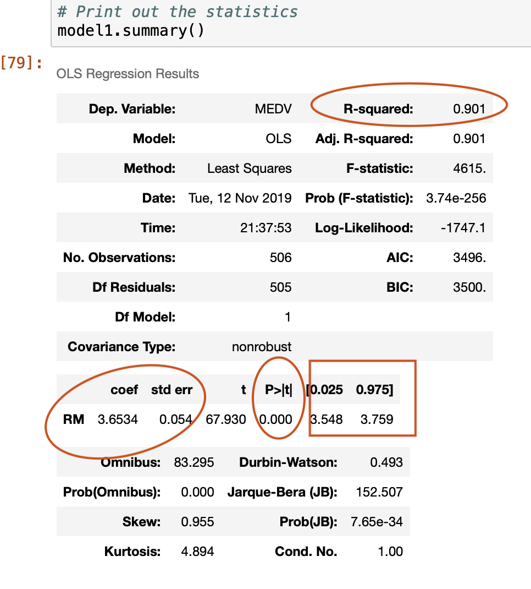
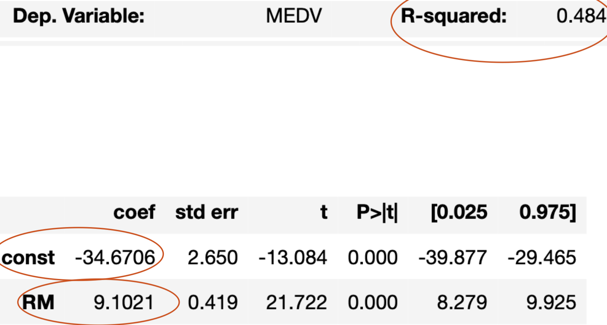

# Lab2:
$$\Huge \text{Linear Regression }$$

## Introduction :
    In this Lab  you'll predict the price, labeled as Median value of owner-occupied homes, of houses in Boston using  a predefined dataSet. 
    
    Objectives :
        - plot different aspect of Dataset features
        - Create different linear & Multiple Regression Models
        - Analyse Models
        - Create a House Price Prediction 
    

####  Statsmodels
- Statsmodels is a Python module that provides classes and functions for the estimation of many different statistical models, as well as for conducting statistical tests, and statistical data exploration


```python
!pip install statsmodels
```


```python
import statsmodels.api as sm
```

#### sklearn
- free software machine learning library for the Python programming language.[3] It features various classification, regression and clustering algorithms


```python
from sklearn import datasets ## imports datasets from scikit-learn
data = datasets.load_boston() ## loads Boston dataset from datasets library 
```


```python
print(data.keys())
```


```python
# numpy adds support for large, multi-dimensional arrays and matrices,
import numpy as np
import pandas as pd
# define the data/predictors as the pre-set feature names  
df = pd.DataFrame(data.data, columns=data.feature_names)

# A DataFrame for the Target
target = pd.DataFrame(data.target, columns=["MEDV"])
```


```python
df.info()
```


```python
# get a glimse of the dataframe
df.head()
```


```python
# Disaplay main dataframe features stats
df.describe()
```


```python
# the target is a dataframe too adn it's related to the Median House Price. MEDV
target.describe()
```

#### Seaborn 
- Seabornis a Python data visualization library based on matplotlib. It provides a high-level interface for drawing attractive and informative statistical graphics.


```python
!pip install seaborn
```


```python
# load the plotting library 
import seaborn as sns
```


```python
# plot all Dataframe variables in a plotting matrix 
sns.pairplot(df)
```


```python
# combine histogram and simple graph plotting for the dataframe crime rate features . 
sns.distplot(df['CRIM'], rug=True)
```


```python
# MEDV. plot 
sns.distplot(target['MEDV'], vertical=True, hist=False)
```

- Modelisation of a linear regression depicting  RM and MEDV
 $$\large  y=f(x)$$
 Wiht  $\text{ x=RM and Y=MEDV}$ 


```python
## Linear Regression without Y intercept

import statsmodels.api as sm

X = df["RM"]
y = target["MEDV"]

# Note the difference in argument order
model1 = sm.OLS(y, X).fit()
predictions = model1.predict(X) # make the predictions by the model

# Print out the statistics
model1.summary()
```




```python
!
```

    /Users/medamin/Projets/DataScience/AWS_sageMaker/Lab_2


```python
### $R^2$
- R-squared ($R^2$) is a statistical measure that represents the proportion of the variance for a dependent variable that's explained by an independent variable or variables in a regression model. 

### P-value
- p-value or probability value is the probability of obtaining test results at least as extreme as the results actually observed during the test, assuming that the null hypothesis is correct
```


```python
target["predicted"]=predictions
target.head()
```

### Evaluation :
$$ \color{red} {\text{ write the linear equation of the model1   above}}$$

$$\huge y= mx+c$$


```python
# Add  constnt to the previous linear Model  


X = df["RM"] ## X usually means our input variables (or independent variables)
y = target["MEDV"] ## Y usually means our output/dependent variable
X = sm.add_constant(X) ## let's add an intercept (beta_0) to our model

# Note the difference in argument order
model2 = sm.OLS(y, X).fit() ## sm.OLS(output, input)
predictions = model2.predict(X)

# Print out the statistics
model2.summary()
```



$$ \color{red} {\text{ write the linear equation of the model2   above}}$$

$$\huge y= mx+c$$

# Lab2:
$$\Huge \text{Multiple Linear Regression }$$

### Part I


```python
X = df[["RM", "LSTAT"]]
y = target["MEDV"]
model3 = sm.OLS(y, X).fit()
predictions = model3.predict(X)
model3.summary()
```

### Evaluation 
- Notice the $R^2$ amelioration :  
What is it's value in the model above?: $_____________$ 
$$ \color{red} {\text{ write the linear equation of the model3   above}}$$

$$\huge y= mx+c$$

### Part II

## Multiple Linear Regression in SKLearn


```python
from sklearn import linear_model
```


```python
# set the undependant and the dependant variable 
X = df
Y = target["MEDV"]
```


```python
# creta a model depicting the MDEV in function of all the Dataframe parameters.
lm = linear_model.LinearRegression()
model = lm.fit(X,Y)
```


```python

```


```python
# generate Price MEDV predition of first 5 records, 
predictions = lm.predict(X)
print(predictions[0:5])
```


```python
target["predicted"]=predictions
target.head()

```


```python
# R² score 
lm.score(X,y)
```


```python
lm.intercept_
```


```python

```


```python

```


```python

```


```python

```


```python

```


```python

```
